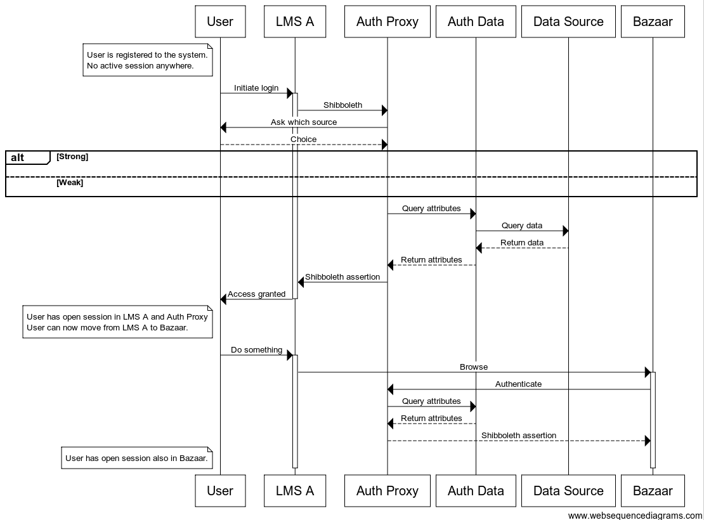

Auth proxy
**********

.. toctree::

  interface

Auth Proxy is an abstraction for authentication interface for services
to ask for session authentication.

Auth Proxy hides the varying technologies of multiple Auth Sources behind
standard interface from services perspective.

Authentication sequence
=======================

::

  note left of User
    User is registered to the system.
    No active session anywhere.
  end note

  User ->+ LMS A: Initiate login
  LMS A -> Auth Proxy: Shibboleth
  Auth Proxy -> User: Ask which source
  User --> Auth Proxy: Choice

  alt Strong
  else Weak
  end

  Auth Proxy -> Auth Data: Query attributes

  Auth Data -> Data Source: Query data
  Data Source --> Auth Data: Return data

  Auth Data --> Auth Proxy: Return attributes
  Auth Proxy -> LMS A: Shibboleth assertion
  LMS A ->- User: Access granted

  note left of User
    User has open session in LMS A and Auth Proxy
    User can now move from LMS A to Bazaar.
  end note

  User ->+ LMS A: Do something
  LMS A ->+ Bazaar: Browse
  Bazaar -> Auth Proxy: Authenticate
  Auth Proxy -> Auth Data: Query attributes

  Auth Data --> Auth Proxy: Return attributes
  Auth Proxy --> Bazaar: Shibboleth assertion

  note left of User
    User has open session also in Bazaar.
  end note

