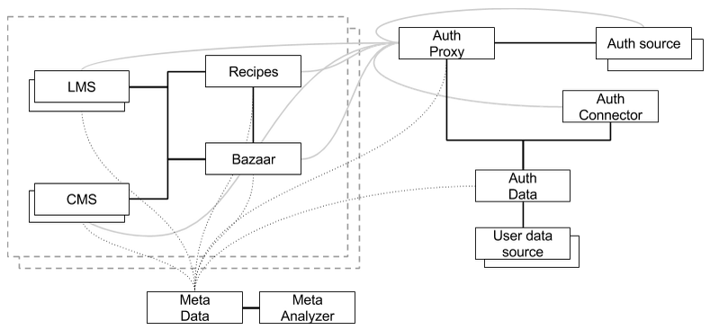

Educloud Alliance Technical Documentation
*****************************************

Educloud Alliance is creating and maintaining a standard which defines
how it is possible to build a ecosystem of users, developers and service providers,
which brings together learning management systems, content management systems,
content producers, administrative systems and all other services to make it possible for
everybody to freely discover, choose, buy, compare and use everything.

Principles
==========

Principles are the key guidance when contributing and defining the standard.
By following the principles one can help the standard to meet the goals set.

User point of view.
 The main principle of the standard is to recognize and appreciate the goals of users.
 By understanding the motivations and rationales behind users’ actions it is possible
 to build environments that fulfill users’ needs and bring joy of use to their daily life.

Everything is open and free.
 Everything is open and free for everyone to use everywhere.

Interoperability.
 Not only people, but also services can discuss with each other,
 change information and thus build knowledge.
 Make it possible for every other service in the ecosystem to
 connect with your service. And bring more value by connecting your
 service to other services.

Be committed.
 Ecosystem includes various actors with freedom to build and maintain their
 own services for their own purposes. With this freedom comes
 the responsibility to be committed to follow the ECA standard.

Excellence.
 Create and contribute to a believable and viable standard which is easy to understand,
 implement and it convinces as many people as possible.

Use existing.
 Use as much as possible existing documentation, interfaces,
 and field tested technologies.
 Make your own contribution reusable.

Offer reference implementation.
 Reference implementation with written documentation is the ultimate proof
 that the idea works and is possible to implement.

Structure of documentation
==========================

Documentation consists of four levels presented in the image:
Stories, Services, Interfaces and Infrastructure.

Stories are the highest level of documentation.
Stories do not describe any technical solution, but focus on explaining the rationale.
Why something needs to be done, and how it should work from the users’ perspective.
A story does not describe a service as such, but the user, the usage environment and the usage flow,
how the services need to connect to other services.

Services documentation tells what functionality is expected from a service,
and how it relates to the stories.
There is also documentation how services are working together.
Services adhere to common user experience guidelines which ensure that the user
feels safe and knows the path back home.

A reference implementation is included for testing the interfaces
and related services built according to the documentation.
This reference implementation is part of standard’s documentation,
and available for service providers.
ECA standard does not require that a service is built according to the reference implementation.
But, as the reference implementation is open source code with free-to-use license,
it can be utilized as the basis of the services.

Interfaces are there for creating pleasing user experiences when several services are
needed to meet the goals of the user. Interfaces enable service-to-service communication
and data sharing, which helps creating seamless experiences to the user.

Infrastructure documentation is the lowest level of documentation describing the whole service
architecture of ECA standard.
It also contains the best practices guidance for hosting the services and the system.

`RFC 2119`__ is used to define common vocabulary for requirements.

__ https://www.ietf.org/rfc/rfc2119.txt

Stories
=======

A story shows a snapshot of user’s life with the system.
It gives insight into what kind of people will use the system
e.g. what kind of teacher, student or other person from the school world.
And why they are using it. The key is to know your users!

The story tells the user’s problem or the goal, which the user wants to achieve.
From the story, reader gets an idea of how the system can help the user
and what kind of features there are.
But it does not specifically tell what technology is used.

The story takes place in the right context i.e. for example
in an environment such as school class, home office, or the bus,
and describes the tools and capabilities e.g. tablet, mobile phone,
limited network access. If relevant to the system,
story may also tell about social context i.e. situations and communication
of people with each other, or with some other systems.

The context of use, characteristics of the user and the goals help to
identify design requirements for the service.
From the story you can see, what other services you may need in order
to fulfill user’s needs properly.

Stories do not tell you what kind of user interface you should build,
or what kind of technical solutions should be used, as it leaves them open.
Only interest is on whether the story is met with the final product or not,
regardless of means.

For the user the whole system should look and feel coherent and there should not be
inconsistencies or places where the actor does not know where in the overall
system she currently is.

Following stories are identified to be the core stories of ECA’s standard.

:doc:`Single Sign-on <story/sso>`
  Authentication and identification of the user should happen only once when she
  begins the session. Moving between services should be seamless.

:doc:`Using learning materials <story/learning_materials>`
  User must be able to use any material the way she wants.

:doc:`Procurement and license management <story/procurement>`
  Procurement of material and services should be easy and
  fair to everybody.

:doc:`Curriculum <story/curriculum>`
  User should always know that what she is doing is in line with the curriculum.

:doc:`Analytics and feedback loops <story/feedback_loops>`
  User should see her progress in real time and it must be possible to
  build feedback loops in all levels of the system.

Services
========

The standard is based on a service oriented architecture where functionality
is split to services. The services defined in the standard are implementing
the stories defined in the standard. The standard is accompanied by reference
implementation which shows in practice how the standard is meant to be working.
The reference implementation is not meant to be production system and it is
not designed as such.

The standard is defined so that it is possible to have multiple instances of all services.
It is up to the production system to define how many instances of
different services are available to the users.

User authentication, identification and profile data
----------------------------------------------------

Authentication is considered separate from other services.
All services need to know something about the user. Different services
need different data about the user, but all of them need to authenticate and/or
identify the user in some way.

These are the services which together form the basis of :doc:`authentication and
identification <auth/index>` of users.

:doc:`Auth Proxy <auth/proxy/index>`
  Common interface for services to use different Auth Sources.
  Provides single sign-on for services.

:doc:`Auth Source <auth/source>`
  Authenticates the user when the user wants to open a session in one of the
  services. Auth Sources are handled by the Auth Proxy.

:doc:`Connector <auth/connector/index>`
  Connects user authentication source and user identity together.
  This makes it possible for the user to identify with multiple
  authentication sources and still have only one identity.
  Only the authentication source knows the credentials for the user.

:doc:`Data <auth/data/index>`
  Common source of user data to all other services.
  Mainly used by the connector to query users and store
  the connection between authentication source and user identity.

Learning material
-----------------

Handling learning material is focused in three key service types.
Learning material is produced by the :term:`CMS` and used in the :term:`LMS`.
Bazaar is mediating between them and allowing many-to-many connections
freely between them.

:doc:`Bazaar <bazaar/index>`
  Service which lets the user to browse and buy material from :term:`CMS` to :term:`LMS`.

:doc:`Recipes <recipes/index>`
  Service which builds collections of learning materials.

:doc:`Learning management system <lms/index>`
  Service which consumes the content produced by the :doc:`Content management systems <cms/index>`.

:doc:`Content management system <cms/index>`
  Service which produces content in some form.

Interfaces
==========

All communication between services must be happen thru interfaces which are
defined in the standard. Interfaces should be based on existing technology
which is already widely used. Interfaces should be easy to understand and
implement by all parties.

:doc:`Authentication attributes study <auth/auth_study>`, and first proposal for
authentication attributes.

:doc:`Auth IF <auth/proxy/interface>`
  User authentication is done by common interface.
  The auth system has :term:`SP` and :term:`IdP` components.

:doc:`Data IF <auth/data/interface>`
  Data Service provides an interface to query for user data from Data Providers.

:doc:`LMS IF <bazaar/interface>`
  Between :doc:`Bazaar <bazaar/index>` and :doc:`LMS <lms/index>`.

:doc:`CMS IF <bazaar/interface>`
  Between :doc:`Bazaar <bazaar/index>` and :doc:`CMS <cms/index>`.

Infrastructure
==============

The standard would not be complete without defining how the system as a whole
is working and how the reference implementation is built. The production
system can be different.

Contributions
=============

If you want to contribute to ECA put your contributions in the
open and begin the discussion how your contribution could benefit
ECA and everybody else.

Read more about :doc:`contributions <contributions>`.

